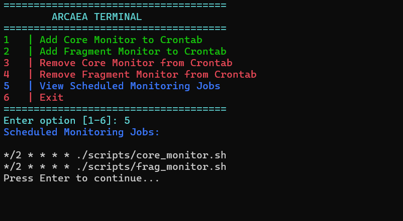
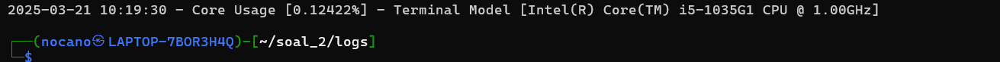

# Laporan Penjelasan dan Penyelesaian Soal Modul 1
## Anggota 
| Nama                      | NRP        |
|---------------------------|------------|
|Muhammad Hikari Reiziq R.  | 5027241079 |
|Dira Muhammad Ilyas S. A.  | 5027241033 |
|Thariq Kyran Aryunaldi     | 5027241073 |

## Soal 1
Pada awal pengerjaan soal pertama, kita diminta untuk menginstall file bernama reading_data.csv. Kita perlu mengunduh dahulu agar bisa kita eksekusi di terminal Linux kita.
### Download File CSV

```
wget "https://drive.usercontent.google.com/u/0/uc?id=1l8fsj5LZLwXBlHaqhfJVjz_T0p7EJjqV&export=download" -O reading_data.csv && echo "File berhasil didownload" || echo "Gagal"
```
Dikarenakan file tersebut online maka kita menggunakan command `wget` berfungsi untuk mengunduh file dengan format HTTP maupun HTTPS. Masukkan link URL File tersebut ke dalam `wget` dan membuat kondisi if else menggunakan operator `||` dan command `echo` serta isi pesan yang ingin dikeluarkan. Cek isi file yang telah diunduh menggunakan `cat reading_data.csv`
```
"File berhasil didownload"
```
Namun, apabila hasil dari command `cat` tersebut yaitu seperti berikut ini:
```
<!DOCTYPE html><html<head>title>Google Drive - Virus scan warning</title><meta.....
```
Hal Ini terjadi karena Google Drive menampilkan halaman peringatan sebelum file diunduh, bukan langsung mengirimkan file. Google Drive memiliki proteksi khusus terhadap `wget`. Untuk mengatasi ini, kita bisa menggunakan `gdown`:
```
sudo apt update
sudo apt install python3-pip 
pip3 install --break-system-packages gdown
gdown --id 1l8fsj5LZLwXBlHaqhfJVjz_T0p7EJjqV -O reading_data.csv
cat reading_data.csv
```
1. Update`sudo apt update` Memastikan daftar paket di sistem sudah diperbarui sebelum instalasi.
2. Install `python3-pip` Menginstal pip untuk Python 3 agar bisa mengelola paket Python.
3. Install `gdown` dengan Override dengan 
Menggunakan opsi `--break-system-packages` untuk melewati pembatasan manajemen paket pada Python yang dikelola sistem.
4. Download File dari Google Drive: `gdown --id 1l8fsj5LZLwXBlHaqhfJVjz_T0p7EJjqV -O reading_data.csv` Menggunakan `gdown` untuk mengunduh file dari Google Drive berdasarkan ID.

Cek isi file yang telah diunduh menggunakan `cat reading_data.csv`
## Soal 1A
```
awk -F',' '$2 ~ /Chris Hemsworth/ {count++} END {if (count > 0) printf "Chris Hemsworth membaca %d buku\n", count; else print "Tidak ditemukan\n"}' reading_data.csv
```
Penjelasan:
1. `awk -F ','`
    - **`F','`** berarti menggunakan tanda **koma (`,`)** sebagai pemisah kolom karena file CSV biasanya dipisahkan dengan koma.
2. **`$2 ~ /Chris Hemsworth/ {count++}`**
    - **`$2`** mengacu pada **kolom ke-2**, yang berisi **nama pembaca**.
    - **`~ /Chris Hemsworth/`** Memeriksa apakah nama dalam **kolom ke-2** cocok dengan "Chris Hemsworth".
    - Jika cocok, maka variabel **`count`** akan bertambah **1**.
3. **Blok `END { ... }`**
    - Blok `END` dieksekusi setelah semua baris pada file **reading_data.csv** dibaca.
    - **`if (count > 0)`**
        - Jika `count` lebih besar dari **0**, artinya ada data yang cocok dengan "Chris Hemsworth".
        - Maka, tampilkan **"Chris Hemsworth membaca `X` buku"** dengan jumlah buku yang dihitung.
    - **`else print "Tidak ditemukan\n"`**
        - Jika `count == 0`, artinya **Chris Hemsworth tidak ditemukan di file**, sehingga ditampilkan `"Tidak ditemukan"`.

**Hasil akhir**:
```
Chris Hemsworth membaca 56 buku
```
## Soal 1B
Soal selanjutnya disuruh mencari rata-rata durasi membaca buku dengan device tablet dari file reading_data.csv.
```
awk -F"," '$8 == "Tablet" {total += $6; count++} END {if (count > 0) printf "Rata-rata durasi membaca dengan Tablet adalah %.2f menit\n", total/count; else printf "Tidak ada data tablet\n"}' reading_data.csv
```
### Penjelasan

1. **`awk -F","`**
    - **`F","`** menggunakan **koma (`,`)** sebagai pemisah antar kolom, karena **reading_data.csv** adalah file CSV (Comma-Separated Values).
2. **`$8 == "Tablet" {total += $6; count++}`**
    - **`$8 == "Tablet"`** → Memeriksa apakah **kolom ke-8** berisi kata `"Tablet"`.
    - Jika ya, maka:
        - **`total += $6`** → Menambahkan nilai dari **kolom ke-6** (durasi membaca) ke variabel `total`.
        - **`count++`** → Menghitung berapa banyak data yang cocok dengan `"Tablet"`.
3. **Blok `END { ... }`**
    - Setelah semua baris dalam **reading_data.csv** dibaca, blok **END** akan dijalankan.
    - **`if (count > 0)`**
        - Jika ada **setidaknya satu data** yang sesuai (`count > 0`), maka:
            - **`total/count`** → Menghitung rata-rata durasi membaca.
            - **`printf "Rata-rata durasi membaca dengan Tablet adalah %.2f menit\n", total/count;`**
                - **`%.2f`** berarti hasilnya akan ditampilkan dengan **2 angka di belakang koma**.
    - **`else printf "Tidak ada data tablet\n"`**
        - Jika **tidak ada satupun data** (`count == 0`), maka ditampilkan satunya

**Hasil akhir**:
```
Rata-rata durasi membaca dengan Tablet adalah 152.38 menit
```
## Soal 1C
Soal ini kita disuruh menganalisis file dimana mencari Pembaca dengan rating tertinggi beserta nama (Name) dan judul bukunya (Book_Title).
```
awk -F"," 'NR > 1 {if ($7 > max) {max = $7; nama = $2; judul=$3}} END {if (max != "" ) print "Pembaca dengan rating tertinggi:", nama, "-", judul, "-", max; else print "Data tidak ditemukkan"}' reading_data.csv
```
> Objective: Nama pembaca - judul buku - rating tertinggi
### Penjelasan:
1. **`NR > 1`**
    - **`NR`** adalah **Nomor Baris** (Number of Record).
    - **`NR > 1`** berarti **melewati baris pertama** (biasanya berisi header), agar hanya membaca **data**.
2. **`if ($7 > max) {max = $7; nama = $2; judul=$3}`**
    - **`$7`** → Kolom ke-7 berisi **rating**.
    - **Jika rating ($7) lebih besar dari `max`**, maka:
        - **`max = $7`** → Update nilai rating tertinggi.
        - **`nama = $2`** → Simpan nama pembaca (dari kolom ke-2).
        - **`judul = $3`** → Simpan judul buku (dari kolom ke-3).
    - Ini akan **menyimpan pembaca dan buku dengan rating tertinggi**.
3. **Blok `END { ... }`**
    - Setelah semua baris diproses, bagian **END** akan dijalankan.
4. `{if (max != "" ) print "Pembaca dengan rating tertinggi:", nama, "-", judul, "-", max; else print "Data tidak ditemukkan"}'`
    - `(max != "" )` → Mengeksekusi perintah `print` bila nilai dari variabel max tidak kosong.
    - `else print "Data tidak ditemukkan"` → Bila tidak ada nilai dari variabel `max` maka akan mengeksekusi `else`

**Hasil akhir**:
```
Pembaca dengan rating tertinggi: Robert Downey Jr. - Deep Space Mysteries - 6.0
```
## Soal 1D
Terakhir disuruh mencari Genre paling populer di Asia ditambah harus setelah tahun 2023 serta berapa banyak buku yang dibaca.
```
awk -F"," '
NR > 1 {
    split($5, date, "-"); 
    if ($9 == "Asia" && date[1] > 2023) 
        count[$4]++;}
END {
		max = 0
		for (genre in count) {
			if (count[genre] > max){
				max = count[genre];
				popular = genre;
			  }
		   }
		if (max > 0)
			printf "Genre paling populer di Asia setelah 2023 adalah %s dengan %d buku.\n", popular, max;
		else 
			print "Tidak ada data sesuai kriteria";
}' reading_data.csv
```
> Objective: Genre paling populer di Asia setelah 2023 adalah Science dengan 1 buku.
### Penjelasan
1. **`awk -F","`**
    - Pemisah antar kolom dengan koma
2. **`NR > 1`** 
    - `NR > 1` memastikan baris pertama diabaikan agar tidak dihitung sebagai data.
3. **`split($5, date, "-");`**
    - `split($5, date, "-")` memecah **kolom ke-5 (Read_Date)** berdasarkan tanda .
    - Hasilnya, **tahun** akan disimpan di `date[1]`, **bulan** di `date[2]`, dan **hari** di `date[3]`.
4. **`if ($9 == "Asia" && date[1] > 2023)`**
    - **$9 == "Asia"** → Memastikan **kolom ke-9 (Region)** adalah "Asia".
    - **date[1] > 2023** → Memastikan tahun lebih besar dari 2023 (**setelah 31 Desember 2023**).
5. **`count[$4]++`**
    - **$4** adalah **kolom Genre**.
    - **count[$4]++** menambahkan 1 ke dalam array `count`, yang berisi jumlah buku yang dibaca untuk masing-masing genre.
6. **`END { max = 0; for (genre in count) { ... }`**
    - Di blok **END**, kita mulai mencari genre paling populer:
    - **`max = 0`** → guna menyimpan jumlah maksimal buku dalam suatu genre.
    - **Loop `for (genre in count)`**
        - Memeriksa semua genre yang telah dihitung.
        - Jika **count[genre] lebih besar dari max**, maka:
            - **max diperbarui dengan nilai tersebut.**
            - **Nama genre disimpan di `popular`.**

**Hasil akhir**:
```
Genre paling populer di Asia setelah 2023 adalah Science dengan 2 buku.
```
## Rangkuman codingan dari soal 1 Modul 1
```
sudo apt update && sudo apt install python3-pip && pip3 install gdown && gdown --id 1l8fsj5LZLwXBlHaqhfJVjz_T0p7EJjqV -O reading_data.csv && cat reading_data.csv
awk -F',' '$2 ~ /Chris Hemsworth/ {count++} END {if (count > 0) printf "Chris Hemsworth membaca %d buku\n", count; else print "Tidak ditemukan\n"}' reading_data.csv
awk -F"," '$8 == "Tablet" {total += $6; count++} END {if (count > 0) printf "Rata-rata durasi membaca dengan Tablet adalah %.2f menit\n", total/count; else printf "Tidak ada data tablet\n"}' reading_data.csv
awk -F"," 'NR > 1 {if ($7 > max) {max = $7; nama = $2; judul=$3}} END {if (max != "" ) print "Pembaca dengan rating tertinggi:", nama, "-", judul, "-", max; else print "Data tidak ditemukkan"}' reading_data.csv
awk -F"," 'NR > 1 { split($5, date, "-"); if ($9 == "Asia" && date[1] > 2023) count[$4]++ } END { max = 0; for (genre in count) { if (count[genre] > max) { max = count[genre]; popular = genre } } if (max > 0) printf "Genre paling populer di Asia setelah 2023 adalah %s dengan %d buku.\n", popular, max; else print "Tidak ada data sesuai kriteria" }' reading_data.csv
```
# Soal 2

---

## Pendahuluan
### Pembuka Soal
Anda merupakan seorang “Observer”, dari banyak dunia yang dibuat dari ingatan yang berbentuk “fragments” - yang berisi kemungkinan yang dapat terjadi di dunia lain. Namun, akhir-akhir ini terdapat anomali-anomali yang seharusnya tidak terjadi, perpindahan “fragments” di berbagai dunia, yang kemungkinan terjadi dikarenakan seorang “Seeker” yang berubah menjadi “Ascendant”, atau dalam kata lain, “God”. Tidak semua “Observer” menjadi “Player”, tetapi disini anda ditugaskan untuk ikut serta dalam menjaga equilibrium dari dunia-dunia yang terbuat dari “Arcaea”. [Author: Nathan / etern1ty]

### Interpretasi Keseluruhan Soal
Dalam dunia "Arcaea", sistem login/register dibutuhkan untuk membedakan antara "Player" dan "Observer" serta mengamankan akses ke dunia tersebut. Sistem ini mencakup:

- **Pembuatan akun** melalui register dan login.
- **Validasi keamanan** untuk memastikan format email benar dan password kuat.
- **Penyimpanan data akun yang aman** menggunakan hashing SHA-256.
- **Pemantauan CPU dan RAM** untuk menjaga kestabilan dunia "Arcaea".
- **Crontab Manager** untuk mengotomatisasi pemantauan sumber daya sistem.
- **Antarmuka utama** untuk mengakses semua fitur dengan mudah.

---

## Soal 2A - “First Step in a New World”
### Deskripsi Soal
Tugas pertama, dikarenakan kejadian “Axiom of The End” yang semakin mendekat, diperlukan sistem untuk mencatat “Player” aktif agar terpisah dari “Observer”. Buatlah dua shell script, login.sh dan register.sh, yang dimana database “Player” disimpan di /data/player.csv. Untuk register, parameter yang dipakai yaitu email, username, dan password. Untuk login, parameter yang dipakai yaitu email dan password.

### Pembuatan direktori dan script awal
```sh
code login.sh
code register.sh
mkdir data
cd data
touch player.csv
```
`code` digunakan untuk menulis file dengan visual studio code 
`mkdir` untuk membuat direktori data
`cd` untuk masuk ke direktori
`touch` untuk membuat file kosong dengan nama dan format yang telah ditentukan (csv)
### Kode pada register.sh
```
data_folder="./data"
player_db="$data_folder/player.csv"
```
menyimpan alamat player.csv sehingga dapat melakukan read,write pada player.csv

```
mkdir -p "$data_folder"
touch "$player_db"
```
untuk berjaga-jaga bila user belum membuat direktori maka ditambahkan command tersebut

```
read -p "Enter your email: " email
```
untuk menerima email yang di-input user

```
read -p "Enter your username: " username
```
untuk menerima username yang di-input user

```
read -s -p "Enter password: " password
```
untuk menerima password yang di-input user

### Kode pada login.sh
```
read -p "Enter your email: " email
```
untuk menerima input email untuk login

```
read -s -p "Enter password: " password
```

---

## Soal 2B - “Radiant Genesis”
### Deskripsi Soal
Sistem login/register untuk para "Player" tentunya memiliki constraint, yaitu validasi email dan password. 
Email harus memiliki format yang benar dengan tanda @ dan titik, sementara password harus memiliki minimal 8 karakter, setidaknya satu huruf kecil, satu huruf besar, dan satu angka untuk menjaga keamanan data di dunia “Arcaea”.

### Tujuan
- Memastikan format email valid.
- Memastikan password aman.

### Implementasi (`login.sh`)
1. Meminta input **email dan password**.
2. Cek apakah **email terdaftar**.
3. Verifikasi password dengan **hashing SHA-256**.

### Kode pada register.sh
```
if [[ "$email" =~ ^[a-zA-Z0-9._%+-]+@[a-zA-Z0-9.-]+\.[a-zA-Z]{2,}$ ]]; then
```
mengecek validasi email
```
if [[ ${#password} -ge 8 && "$password" =~ [A-Z] && "$password" =~ [a-z] && "$password" =~ [0-9] ]];
```
mengecek validasi password
```
# Input email
while true; do
    read -p "Enter your email: " email
    if [[ "$email" =~ ^[a-zA-Z0-9._%+-]+@[a-zA-Z0-9.-]+\.[a-zA-Z]{2,}$ ]]; then
        if grep -q "^$email," "$player_db"; then
            echo "Email is already registered. Please use another email."
        else
            break
        fi
    else
        echo "Invalid email format. Try again."
    fi
done

# Input username
read -p "Enter your username: " username

# Input password
while true; do
    read -s -p "Enter password: " password
    echo
    if [[ ${#password} -ge 8 && "$password" =~ [A-Z] && "$password" =~ [a-z] && "$password" =~ [0-9] ]]; then
        hashed_password=$(echo -n "$salt$password" | sha256sum | awk '{print $1}')
        echo "$email,$username,$hashed_password" >> "$player_db"
        echo "Registration successful"
        sleep 2
        break
    else
        echo "Password must be at least 8 characters, contain an uppercase letter, a lowercase letter, and a number."
    fi
done
```
Digunakan while loop agar user dapat retry menginput email dan password bila tidak valid, serta diberi petunjuk bagaimana format yang valid

### Kode pada login.sh
```
if ! grep -q "^$email," "$player_db"; then
    echo "Email not found. Please register first."
    exit 1
fi
```
Pada login.sh cukup mengecek apakah email yang user masukkan cocok dengan data yang sudah ada pada `player.csv`
```
echo
hashed_password=$(echo -n "$salt$password" | sha256sum | awk '{print $1}')

# Validate credentials
if grep -q "^$email,.*,$hashed_password" "$player_db"; then
    echo "Login successful. Welcome!"
else
    echo "Incorrect password. Try again."
    exit 1
fi
```
Melakukan hashing(dijelaskan pada soal selanjutnya) dan mencocokan hasilnya dengan data pada `player.csv`

---

## Soal 2C - “Unceasing Spirit”
### Deskripsi Soal
Karena diperlukan pengecekan keaslian “Player” yang aktif, maka diperlukan sistem untuk pencegahan duplikasi “Player”. Jadikan sistem login/register tidak bisa memakai email yang sama (email = unique), tetapi tidak ada pengecekan tambahan untuk username.

### Tujuan
- Mencegah penggunaan email yang sama untuk lebih dari satu akun.

### Kode pada register.sh
```
if grep -q "^$email," "$player_db"; then
            echo "Email is already registered. Please use another email."
        else
            break
        fi
```
`grep` mengambil email yang cocok sesuai yang telah diinputkan bila ada kecocokan maka email tidak dianggap valid


---

## Soal 2D - 
### Deskripsi Soal
Password adalah kunci akses ke dunia Arcaea. Untuk menjaga keamanan "Player", password perlu disimpan dalam bentuk yang tidak mudah diakses. Gunakan algoritma hashing sha256sum yang memakai static salt (bebas).

### Tujuan
- Mengamankan password agar tidak tersimpan dalam bentuk plaintext.
### Implementasi
1. Menggunakan **SHA-256 dengan static salt**.
2. Simpan hasil hash ke dalam `player.csv`.
### Code program
```
salt="arcaea_salt"
```
static salt disini menggunakan teks "arcaea_salt
```
if [[ ${#password} -ge 8 && "$password" =~ [A-Z] && "$password" =~ [a-z] && "$password" =~ [0-9] ]]; then
        hashed_password=$(echo -n "$salt$password" | sha256sum | awk '{print $1}')
        echo "$email,$username,$hashed_password" >> "$player_db"
        echo "Registration successful"
        sleep 2
        break
    else
        echo "Password must be at least 8 characters, contain an uppercase letter, a lowercase letter, and a number."
    fi
```
apa bila password telah memenuhi syarat maka akan dihashing (algoritma SHA-256) dan disave di player.csv

---

## Soal 2E - “The Brutality of Glass”
### Deskripsi Soal
Setelah sukses login, "Player" perlu memiliki akses ke sistem pemantauan sumber daya. Sistem harus dapat melacak penggunaan CPU (dalam persentase) yang menjadi representasi “Core” di dunia “Arcaea”. Pastikan kalian juga bisa melacak “terminal” yang digunakan oleh “Player”, yaitu CPU Model dari device mereka. 
Lokasi shell script: ./scripts/core_monitor.sh


### Tujuan
- Memantau penggunaan CPU secara real-time.

### Implementasi (`core_monitor.sh`)
1. Mengambil **persentase penggunaan CPU**.
2. Mengambil **model CPU**.
   
### Persiapan
```
mkdir scripts
code core_monitor.sh
```
Pada directori soal kita buat direktori untuk scripts dan membuat scripts
### Kode pada scripts
```
PREV_IDLE=$(awk '/^cpu / {print $5}' /proc/stat)
PREV_TOTAL=$(awk '/^cpu / {sum=0; for (i=2; i<=8; i++) sum+=$i; print sum}' /proc/stat)
```
`/proc/stat` menyimpan total waktu yang dihabiskan CPU dalam berbagai status (user, system, idle, dll.).
`$5` adalah jumlah waktu CPU dalam keadaan idle.
Total CPU time dihitung dengan menjumlahkan seluruh kolom dari $2 hingga $8, kecuali kolom pertama (`cpu`).
```
sleep 1
```
Hal ini dilakukan agar kita bisa menghitung perubahan penggunaan CPU dalam rentang waktu 1 detik.
```
IDLE=$(awk '/^cpu / {print $5}' /proc/stat)
TOTAL=$(awk '/^cpu / {sum=0; for (i=2; i<=8; i++) sum+=$i; print sum}' /proc/stat)
```
Sama seperti sebelumnya, kita mengambil nilai idle terbaru (`IDLE`) dan total CPU time terbaru (`TOTAL`).
```
DIFF_IDLE=$((IDLE - PREV_IDLE))
DIFF_TOTAL=$((TOTAL - PREV_TOTAL))
```
`DIFF_IDLE`: Selisih waktu idle dalam 1 detik.
`DIFF_TOTAL`: Selisih total waktu CPU yang digunakan dalam 1 detik.
```
CORE_USAGE=$(awk -v total="$DIFF_TOTAL" -v idle="$DIFF_IDLE" 'BEGIN { usage = (100*(total-idle))/total; printf "%.5f", usage }')
```
Menggunakan AWK untuk melakukan perhitungan floating-point (%.5f menampilkan 5 angka desimal).
```
CORE_USAGE=$(echo "$CORE_USAGE" | sed -e 's/0*$//' -e 's/\.$//')
```
Mengoutput performance cpu yang telah dikalkulasi dan menghapus trailing zeros (0.50000 → 0.5).
serta menghapus titik jika angka desimal habis (5. → 5).

```
CORE_MODEL=$(lscpu | awk -F ': ' '/Model name/ {gsub(/^[ \t]+/, "", $2); print $2}')
```
Command diatas untuk mendapat model terminal/model cpu user dan menyimpannya pada variabel `CORE_MODEL`

---

## Soal 2F “In Grief and Great Delight”
### Deskripsi soal
Selain CPU, “fragments” juga perlu dipantau untuk memastikan equilibrium dunia “Arcaea”. RAM menjadi representasi dari “fragments” di dunia “Arcaea”, yang dimana dipantau dalam persentase usage, dan juga penggunaan RAM sekarang. 
Lokasi shell script: ./scripts/frag_monitor.sh
Pastikan perhitungan kalian untuk CPU dan RAM memiliki output yang sama dengan suatu package resource checker, ex: top, htop, btop, bpytop. 

### Tujuan
- Memantau penggunaan RAM secara real-time.

### Implementasi (`frag_monitor.sh`)
1. Mengambil **persentase penggunaan RAM**.
2. Menyimpan informasi **total dan available RAM**.

### Persiapan
Pada directori `/scripts`
```
code frag_monitor.sh
```
kita buat frag_monitor.sh


### Kode pada frag_monitor.sh
```
TOTAL_MEM=$(awk '/MemTotal/ {print $2}' /proc/meminfo)
AVAIL_MEM=$(awk '/MemAvailable/ {print $2}' /proc/meminfo)
```
`MemTotal`: Jumlah total RAM dalam satuan kilobyte (kB).
`MemAvailable`: RAM yang masih tersedia dan dapat digunakan oleh sistem tanpa perlu mengambil dari swap.

```
USED_MEM=$((TOTAL_MEM - AVAIL_MEM))
```

Hasilnya dalam kilobyte (kB).

```
FRAG_USAGE=$(awk -v used="$USED_MEM" -v total="$TOTAL_MEM" 'BEGIN { usage = (100*used)/total; printf "%.2f", usage }')
```
Menggunakan AWK untuk mendapatkan hasil dengan 2 angka desimal (`%.2f`).

---

## Soal 2G “On Fate's Approach”

### Tujuan
- Mengatur pemantauan CPU dan RAM secara otomatis dengan crontab.

### Implementasi (`manager.sh`)
1. **Menambah atau menghapus monitoring CPU dan RAM** dari crontab.
2. **Menampilkan daftar job aktif** di crontab.

### Kode Program
Pendefinisian Variabel
```
CORE_MONITOR_SCRIPT="./scripts/core_monitor.sh"
FRAG_MONITOR_SCRIPT="./scripts/frag_monitor.sh"
CORE_LOG="./logs/core.log"
FRAG_LOG="./logs/fragment.log"
```
CORE_MONITOR_SCRIPT → Lokasi script monitoring CPU.
FRAG_MONITOR_SCRIPT → Lokasi script monitoring RAM.
CORE_LOG → File log untuk mencatat aktivitas monitoring CPU.
FRAG_LOG → File log untuk mencatat aktivitas monitoring RAM.
```
INTERVAL="*/2 * * * *"
```
INTERVAL → Menentukan crontab agar dijalankan setiap 2 menit.
```
add_core_monitor() {
    (crontab -l 2>/dev/null | grep -v "$CORE_MONITOR_SCRIPT"; echo "$INTERVAL $CORE_MONITOR_SCRIPT") | crontab -
    echo "$(date '+%Y-%m-%d %H:%M:%S') - Core Monitor added to crontab (Puasa Daud schedule)." >> "$CORE_LOG"
}
```
Menambahkan perintah monitoring CPU ke crontab jika belum ada (grep -v mencegah duplikasi).
Mencatat log ke dalam core.log dengan format [YYYY-MM-DD HH:MM:SS] - Core Monitor added.
```
add_frag_monitor() {
    (crontab -l 2>/dev/null | grep -v "$FRAG_MONITOR_SCRIPT"; echo "$INTERVAL $FRAG_MONITOR_SCRIPT") | crontab -
    echo "$(date '+%Y-%m-%d %H:%M:%S') - Fragment Monitor added to crontab." >> "$FRAG_LOG"
}
```
Sama seperti monitoring CPU, tetapi untuk monitoring RAM.
Log aktivitas disimpan ke dalam fragment.log.
```
remove_core_monitor() {
    (crontab -l 2>/dev/null | grep -v "$CORE_MONITOR_SCRIPT") | crontab -
    echo "$(date '+%Y-%m-%d %H:%M:%S') - Core Monitor removed from crontab." >> "$CORE_LOG"
}
```
Menghapus perintah monitoring CPU dari crontab menggunakan grep -v.
Mencatat log penghapusan di core.log.
```
remove_frag_monitor() {
    (crontab -l 2>/dev/null | grep -v "$FRAG_MONITOR_SCRIPT") | crontab -
    echo "$(date '+%Y-%m-%d %H:%M:%S') - Fragment Monitor removed from crontab." >> "$FRAG_LOG"
}
```
Sama seperti remove_core_monitor, tetapi untuk menghapus monitoring RAM.
Log penghapusan disimpan di fragment.log.

```
view_scheduled_jobs() {
    echo -e "\e[1;34mScheduled Monitoring Jobs:\e[0m"
    crontab -l 2>/dev/null || echo "No scheduled jobs found."
}
```
Menampilkan semua job yang dijadwalkan dalam crontab.
Jika tidak ada job aktif, akan menampilkan pesan "No scheduled jobs found."
```
case "$1" in
    add_core) add_core_monitor ;;
    add_frag) add_frag_monitor ;;
    remove_core) remove_core_monitor ;;
    remove_frag) remove_frag_monitor ;;
    view_jobs) view_scheduled_jobs ;;
    *) echo "Usage: $0 {add_core|add_frag|remove_core|remove_frag|view_jobs}" ;;
esac
```
$1 menentukan perintah yang dijalankan:
add_core → Tambahkan monitoring CPU.
add_frag → Tambahkan monitoring RAM.
remove_core → Hapus monitoring CPU.
remove_frag → Hapus monitoring RAM.
view_jobs → Lihat daftar monitoring yang aktif.
Jika input tidak valid, akan menampilkan cara penggunaan yang benar.


---

## Soal 2H “The Disfigured Flow of Time”
### Deskripsi Soal
Karena tentunya script yang dimasukkan ke crontab tidak mengeluarkan output di terminal, buatlah 2 log file, core.log dan fragment.log di folder ./log/, yang dimana masing-masing terhubung ke program usage monitoring untuk usage tersebut. 
Format log:
CPU
[YYYY-MM-DD HH:MM:SS] - Core Usage [$CPU%] - Terminal Model [$CPU_Model]

RAM
[YYYY-MM-DD HH:MM:SS] - Fragment Usage [$RAM%] - Fragment Count [$RAM MB] - Details [Total: $TOTAL MB, Available: $AVAILABLE MB]


### Tujuan
- Menyimpan log pemantauan CPU dan RAM dalam folder `log/`.

### Implementasi
1. **`core.log`** untuk menyimpan data CPU.
```
echo "$TIMESTAMP - Core Usage [$CORE_USAGE%] - Terminal Model [$CORE_MODEL]" >> "$LOG_FILE"
```
2. **`fragment.log`** untuk menyimpan data RAM.
```
echo "$TIMESTAMP - Fragment Usage [$FRAG_USAGE%] - Fragment Count [$USED_MEM KB] - Details [Total: $TOTAL_MEM KB, Available: $AVAIL_MEM KB]" >> "$LOG_FILE"
```


---

## Soal 2I “Irruption of New Color”
### Deskripsi soal
Sistem harus memiliki antarmuka utama yang menggabungkan semua komponen. Ini akan menjadi titik masuk bagi "Player" untuk mengakses seluruh sistem. Buatlah shell script terminal.sh, yang berisi user flow berikut:
Register
Login
	Crontab manager (add/rem core & fragment usage)
	Exit
Exit


### Tujuan
- Menggabungkan seluruh sistem dalam satu antarmuka utama.

### Implementasi (`terminal.sh`)
1. Menampilkan menu utama.
2. Memanggil script `register.sh`, `login.sh`, dan `manager.sh`.

### Kode pada terminal.sh
Ketika script dijalankan, fungsi display_main_menu akan menampilkan menu utama dengan tiga pilihan utama:
```
echo -e "\e[1;36m====================================="
echo "        ARCAEA TERMINAL"
echo -e "=====================================\e[0m"
echo -e "\e[1;33m1   | Register New Account\e[0m"
echo -e "\e[1;32m2   | Login to Existing Account\e[0m"
echo -e "\e[1;31m3   | Exit\e[0m"
echo -e "\e[1;36m====================================="

```
1 | `Register New Account` → Menjalankan `register.sh` untuk membuat akun baru.
2 | `Login to Existing Account` → Menjalankan `login.sh`, jika berhasil login akan masuk ke menu Crontab Manager.
3 | `Exit` → Keluar dari program.
Note:
Warna teks ditambahkan menggunakan ANSI escape codes untuk tampilan yang lebih menarik di terminal.

```
1)
    ./register.sh
    sleep 2
    display_main_menu
    ;;
```
Saat pengguna memilih opsi `1`, script akan menjalankan `register.sh` untuk proses pendaftaran.
Setelah selesai, sistem menunggu 2 detik (`sleep 2`) dan kembali ke menu utama.

```
2)
    if ./login.sh; then
        display_crontab_menu
    else
        echo -e "\e[1;31mLogin failed. Returning to main menu.\e[0m"
        sleep 2
        display_main_menu
    fi
    ;;
```
Jika login berhasil (`./login.sh` mengembalikan exit code `0`), maka pengguna masuk ke `display_crontab_menu.`
Jika login gagal, akan muncul pesan error dan kembali ke menu utama.
```
3)
    echo -e "\e[1;31mExiting... Goodbye!\e[0m"
    exit 0
    ;;
```
Keluar dari program dengan menampilkan pesan `Exiting... Goodbye!.`
`exit 0` memastikan program berhenti dengan sukses.

```
*)
    echo -e "\e[1;31mInvalid option. Try again.\e[0m"
    sleep 2
    display_main_menu
    ;;
```
Jika pengguna memasukkan angka selain `1-3`, maka akan muncul pesan error, menunggu 2 detik, lalu kembali ke menu utama.
#### Setalah login
Jika pengguna berhasil login, mereka akan masuk ke menu Crontab Manager untuk mengelola monitoring CPU & RAM.
```
echo -e "\e[1;36m====================================="
echo "        ARCAEA TERMINAL"
echo -e "=====================================\e[0m"
echo -e "\e[1;32m1   | Add Core Monitor to Crontab\e[0m"
echo -e "\e[1;32m2   | Add Fragment Monitor to Crontab\e[0m"
echo -e "\e[1;31m3   | Remove Core Monitor from Crontab\e[0m"
echo -e "\e[1;31m4   | Remove Fragment Monitor from Crontab\e[0m"
echo -e "\e[1;34m5   | View Scheduled Monitoring Jobs\e[0m"
echo -e "\e[1;31m6   | Exit\e[0m"
echo -e "\e[1;36m====================================="
```
Pilihan Menu Crontab Manager
Add Core Monitor (Option 1) → Menambahkan monitoring CPU ke crontab.
Add Fragment Monitor (Option 2) → Menambahkan monitoring RAM ke crontab.
Remove Core Monitor (Option 3) → Menghapus monitoring CPU dari crontab.
Remove Fragment Monitor (Option 4) → Menghapus monitoring RAM dari crontab.
View Scheduled Jobs (Option 5) → Melihat daftar monitoring aktif di crontab.
Exit (Option 6) → Keluar dari program.

```
1) ./scripts/manager.sh add_core; display_crontab_menu ;;
2) ./scripts/manager.sh add_frag; display_crontab_menu ;;
3) ./scripts/manager.sh remove_core; display_crontab_menu ;;
4) ./scripts/manager.sh remove_frag; display_crontab_menu ;;
5) ./scripts/manager.sh view_jobs; read -p "Press Enter to continue..."; display_crontab_menu ;;
6) echo -e "\e[1;31mExiting... Goodbye!\e[0m"; exit 0 ;;
```
Untuk menghubungkan dengan `manager.sh`
Setiap pilihan akan memanggil `manager.sh` dengan argumen sesuai kebutuhan (`add_core`, `remove_core`, dll.).
Setelah eksekusi selesai, menu akan ditampilkan kembali (`display_crontab_menu`).
Untuk melihat daftar cron jobs (Option 5), pengguna harus menekan Enter sebelum kembali ke menu.

---
## Testing screenshots

Registrasi


Login


Ketika tidak ada scheduling monitoring atau setelah command 3 dan 4 dilakukan hingga bersih


Setelah dilakukan command 1 dan 2


output core_monitor.sh pada core.log


output frag_monitor.sh pada fragment.log


---

## Kesimpulan
Sistem ini berhasil mengimplementasikan fitur login, register, validasi keamanan, pemantauan CPU & RAM, serta memiliki Crontab Manager untuk mengotomatisasi proses monitoring. Semua data disimpan dengan aman menggunakan hashing SHA-256.

---

# Soal 3

Untuk soal ini diminta membuat skrip interaktif bash. Deskripsi soalnya adalah:

Untuk merayakan ulang tahun ke 52 album The Dark Side of the Moon, tim PR Pink Floyd mengadakan sebuah lomba dimana peserta diminta untuk membuat sebuah script bertemakan setidaknya 5 dari 10 lagu dalam album tersebut. Sebagai salah satu peserta, kamu memutuskan untuk memilih Speak to Me, On the Run, Time, Money, dan Brain Damage. Saat program ini dijalankan, terminal harus dibersihkan terlebih dahulu agar tidak mengganggu tampilan dari fungsi fungsi yang kamu buat. Program ini dijalankan dengan cara ./dsotm.sh --play=”Track” dengan Track sebagai nama nama lagu yang kamu pilih.

5 nama lagu yang di gunakan untuk soal ini adalah:

1. **`Speak to Me`**
    - Untuk nomor 1 kita diberikan API dari https://github.com/annthurium/affirmations, fungsinya adalah untuk memberikan words of affirmations setiap detik.
1. **`On the Run`**
    - Nomor 2 adalah progress bar dari 0 sampai 100 persen, progress bertambah random dengan interval waktu di antara 0.1 sampai 1 detik. 
1. **`Time`**
    - Nomor 3 adalah jam yang menunjukkan waktu, ini termasuk tahun, bulan, hari, jam, menit, dan detik. Jam nya update setiap detik.
1. **`Money`**
    - Nomor 4 adalah animasi menggunakan karakter mata uang yang jatuh dari atas layar.
1. **`Brain Damage`**
    - Nomor 5 menjalankan proses yang sedang berjalan.

   ## Soal 3A - Speak to Me

```
if [[ $song == "Speak to Me" ]]
then
    while [ true ]
    do
        read -n1 -s -t 0.1 key
        if [[ $key == "q" ]]; then
            echo ""
            break
        fi
        af=$(curl -H "Accept: application/text" "https://www.affirmations.dev" 2>/dev/null)
        echo $af|awk -F: '{print $2}'|awk -F} '{print $1}'
        sleep 1
    done
    clear
```
- Jika menggunakan input ``` Speak to Me ``` maka akan memasuki ``` while ``` loop
- Line 10 ```  af=$(curl -H "Accept: application/text" "https://www.affirmations.dev" 2>/dev/null) ``` adalah untuk memanggil API supaya mendapat list affirmations nya.
- Di samping output, API tersebut juga menampilkan statistik yang dimunculkan pada kanal error. Contoh: ``` {"affirmation":"Sucking at something is the first step towards being good at something"} ``` Hal ini akan mengganggu penampilan output yang sebenarnya oleh skrip. Untuk menghilangkan tampilan statistik tersebut, kanal error diarahkan pada null device menggunakan ``` 2>/dev/null ```.
- Jika ``` q ``` ditekan maka akan keluar dari loop dan clear terminal.

  Hasil:
```
  "You got this"
  "You'll figure it out"
  "You're a smart cookie"
  "I believe in you"
```
  ## Soal 3B - On the Run

```
elif [[ $song == "On the Run" ]]
then
    cols=$(($(tput cols) - 7))
    for ((num=1; num<=100; num=num+1))
    do
        echo -n "["
        for ((p=1;p<=$cols;p=p+1))
        do
            if [[ $p -le $(($num*$cols/100)) ]]
            then
                echo -n "░"
            else
                echo -n " "
            fi
        done
        echo -n "] "
        echo -n $num
        echo -n "%"
        sleep $(awk -v seed=$RANDOM 'BEGIN { srand(seed); print 0.1 + rand() * 0.9 }')
        echo -ne "\r"
        read -n1 -s -t 0.1 key
        if [[ $key == "q" ]]; then
            clear
            break
        fi
    done
    echo ""
    clear
  ```
- Jika input adalah ``` On the Run ```, skrip akan menampilkan progress bar yang bergerak dari 0% hingga 100%.
- Lebar progress bar disesuaikan dengan lebar terminal menggunakan ``` tput cols ```.
- Setiap iterasi, progress bar diperbarui dengan karakter ░ dan persentase.
- Waktu delay ``` sleep ``` diatur secara acak antara 0.1 hingga 1 detik.
- Tombol ``` q ``` untuk keluar dari loop.

## Soal 3C - Time

```
elif [[ $song == "Time" ]]
then
    while [ true ]
    do
        read -n1 -s -t 0.1 key
        if [[ $key == "q" ]]; then
            clear
            break
        fi
        echo -n $(date +"%Y-%m-%d %H:%M:%S")
        sleep 1
        echo -ne "\r"
    done
    clear
```
- Jika input adalah ``` Time ```, skrip akan menampilkan waktu saat ini (tahun, bulan, hari, jam, menit, detik yang diperbarui setiap detik.
- Tekan tombol ``` q ``` untuk keluar dari loop.

  ## Soal 3D - Money

```
  elif [[ $song == "Money" ]]
then
    rows=$(tput lines)
    cols=$(tput cols)
    chars=("$" "€" "£" "¥" "¢" "₹" "₩" "₿" "₣")
    clear

    while [ true ]
    do
        read -n1 -s -t 0.1 key
        if [[ $key == "q" ]]; then
            clear
            break
        fi
        for ((i=0; i<10; i++))
        do
            x=$((RANDOM % cols + 1))
            y=$((RANDOM % rows + 1))
            char=${chars[$RANDOM % ${#chars[@]}]}
            echo -ne "\e[${y};${x}H${char}"
        done
        sleep 0.2
        echo -e "\e[1S"
    done
```
- Jika input adalah ``` Money ```, skrip akan menampilkan simbol mata uang acak yang jatuh dari atas layar.
- Simbol mata uang diambil dari array ``` chars ``` dan ditempatkan secara acak di layar.
- ``` tput lines ``` dan ``` tput cols ``` digunakan untuk mendapatkan jumlah baris dan kolom layar terminal.
- Setiap iterasi, layar digulir ke atas ``` \e[1S ``` untuk menciptakan efek animasi.
- Tombol ``` q ``` untuk keluar dari loop.

## Soal 3E - Brain Damage

```
elif [[ $song == "Brain Damage" ]]
then
    top
    clear
```
- ika input adalah ``` Brain Damage ```, skrip akan menjalankan perintah ``` top ``` untuk menampilkan proses yang sedang berjalan.
- Setelah keluar dari top dengan tombol ``` q ```, layar akan dibersihkan.

### Kesimpulan

Skrip bash ini adalah sebuah program interaktif yang merespons input pengguna dengan variabel ``` $song ``` yang akan muncul berbagai efek visual dan fungsionalitas berdasarkan nama lagu-lagu tertentu.

# Laporan Resmi Modul 1 - Soal 4

## Daftar Isi
1. [Pendahuluan](#pendahuluan)  
2. [Soal 4A - Summary Data](#soal-4a---summary-data)  
3. [Soal 4B - Sorting Data](#soal-4b---sorting-data)  
4. [Soal 4C - Pencarian Nama Pokemon](#soal-4c---pencarian-nama-pokemon)  
5. [Soal 4D - Filter Berdasarkan Type](#soal-4d---filter-berdasarkan-type)  
6. [Soal 4E - Error Handling](#soal-4e---error-handling)  
7. [Soal 4F - Help Screen](#soal-4f---help-screen)  
8. [Kesimpulan](#kesimpulan)  
9. [Kendala & Perbaikan](#kendala--perbaikan)  

---

## Pendahuluan  
### Pembuka Soal  
Pada suatu hari, anda diminta teman anda untuk membantunya mempersiapkan diri untuk turnamen Pokemon **"Generation 9 OverUsed 6v6 Singles"** dengan cara membuatkan tim yang cocok untuknya. Tetapi, anda tidak memahami meta yang dimainkan di turnamen tersebut. Untungnya, seorang informan memberikan anda data **pokemon_usage.csv** yang bisa dianalisis.  

### Interpretasi Keseluruhan Soal  
Untuk menganalisis data tersebut, dibuatlah script **`pokemon_analysis.sh`** yang memiliki fitur:  
- **Melihat ringkasan data** (Pokemon dengan Usage% dan Raw Usage tertinggi).  
- **Mengurutkan data berdasarkan kolom tertentu**.  
- **Mencari Pokemon berdasarkan nama**.  
- **Menyaring Pokemon berdasarkan tipe**.  
- **Menangani kesalahan input** agar program tidak crash.  
- **Menyediakan help screen dengan penjelasan lengkap**.  

---

## Soal 4A - Summary Data  
### Deskripsi Soal  
Menampilkan **Pokemon dengan Usage% dan Raw Usage tertinggi** dalam dataset.  

### Implementasi (`pokemon_analysis.sh --info`)  
1. Membaca dataset `pokemon_usage.csv`.  
2. Menemukan **Pokemon dengan Usage% tertinggi**.  
3. Menemukan **Pokemon dengan Raw Usage tertinggi**.  
4. Menampilkan hasil dalam format yang jelas.  

### Kode pada `pokemon_analysis.sh`  
```sh
awk -F ',' '
NR > 1 {
    usage = $2 + 0
    rawUsage = $3 + 0
    if (usage > maxUsage) {
        maxUsage = usage
        highestPokemonUsage = $1
    }
    if (rawUsage > maxRawUsage) {
        maxRawUsage = rawUsage
        highestPokemonRawUsage = $1
    }
}
END {
    print "Summary of " FILENAME
    print "Highest Adjusted Usage: " highestPokemonUsage " with " maxUsage "%"
    print "Highest Raw Usage: " highestPokemonRawUsage " with " maxRawUsage " uses"
}' "$csv_file"
```

## Soal 4B - Sorting Data
### Deskripsi Soal
Mengurutkan Pokemon berdasarkan kolom tertentu (Usage%, Raw Usage, HP, Atk, dll.).

### Implementasi (pokemon_analysis.sh --sort <kolom>)
Membaca dataset pokemon_usage.csv.
Mengurutkan berdasarkan kolom yang diminta.
Menampilkan hasil dalam format CSV.
### Kode pada pokemon_analysis.sh
```
declare -A column_map
column_map=(
    ["name"]=1 ["usage"]=2 ["raw"]=3 ["hp"]=6 ["atk"]=7
    ["def"]=8 ["spatk"]=9 ["spdef"]=10 ["speed"]=11
)

if [[ -z ${column_map[$option]} ]]; then
    echo "Error: Invalid column name '$option'."
    exit 1
fi
col_index=${column_map[$option]}
echo "$(head -n 1 "$csv_file")"
if [[ "$col_index" -eq 1 ]]; then
    tail -n +2 "$csv_file" | sort -t ',' -k"$col_index","$col_index"
else
    tail -n +2 "$csv_file" | sort -t ',' -k"$col_index","$col_index" -nr
fi
```
## Soal 4C - Pencarian Nama Pokemon
### Deskripsi Soal
Menampilkan statistik dari Pokemon berdasarkan nama.

### Implementasi (pokemon_analysis.sh --grep <nama>)
Membaca dataset pokemon_usage.csv.
Mencari Pokemon yang sesuai dengan nama yang dimasukkan.
Menampilkan hasil dalam format CSV.

### Kode program
```
awk -F',' -v name="$option" 'NR==1 || tolower($1) == tolower(name)' "$csv_file"
```
## Soal 4D - Filter Berdasarkan Type
### Deskripsi Soal
Menampilkan Pokemon yang memiliki tipe tertentu.

### Implementasi (pokemon_analysis.sh --filter <type>)
Membaca dataset pokemon_usage.csv.
Memfilter berdasarkan tipe yang diminta.
Menampilkan hasil dalam format CSV.

### Kode program
```
awk -F ',' -v type="$option" 'NR > 1 && (tolower($4) == tolower(type) || tolower($5) == tolower(type))' "$csv_file" | sort -t ',' -k2 -nr
```

## Soal 4E - Error Handling
### Deskripsi Soal
Menangani kesalahan input dengan pesan error yang jelas.
### Kode
```
if [[ -z "$option" ]]; then
    echo "Error: no filter option provided"
    exit 1
fi
```

## Soal 4F - Help screen yang menarik
### Kode Program
```

if [ "$1" = "--help" ] || [ "$1" = "-h" ] || [ "$#" -lt 2 ]; then
    echo "                                              @@@@@@@@@@@@@@@                                       
               +++@@@@@@@               @@@@@@=........:----+@@@@                                   
                   ++#@@@@%*+        ++%%+-...:=#@@@@@@@@@%*+=--#@@                                 
                     @@@@@@@#++    ++#@@%+=@@@@@@         @@@@#+==#@                                
                     @@@@@@@@@@  ++*@@@@@@@@@                 @@+=#@            @@@@@@@@@@@@        
                     @@@@@@@@@#+*@@@@@@@@@@@@                 @@*+==@@     @%%%%=.........:*%%%@    
                     ++%@@@@@@@@@@@@@@@@@@%++                   @%+=@@     @#:..:-%@@@@@@+----+@@   
                      @@@@@@@@@@@@@@@@@@@@@ @@@@@@@@@@@@@@      @%+=@@  @@@.:-+@@@@      @@@%-+@@   
                       ++@@@%*#%%%%%@@@@%*+%*-===========%%%@@  @%+=@@ @%=.=+%@           @@%==+#@@ 
                         +*@@@#+===+@@@@%+====*@@@@@@@@#++++*@@@@%*+@@@%%+-@@@              @@#=#@@@
                              @@@@@@@@@@@@@@@@@        @@@@@@@@@@%*+@@@*-++@@@            @@@@#+#@@@
                       @@@@%%%*++++++#@*++++*%%%%%@@@@%+-........:*%@@@#+%@              @@@@@@@@@@@
                     @@%%%#+++++==+++#%*++++++++++%%%#=-:...:-----::%%%#*%@              @@@@@@@@@@@
                     @@*++++=-=+=--=+++++==++=-=+++++#@@@..------------*@@@              @@@@@@@@@@@
                  @@%*++++=-----..-=+++++++=-:....+++++++%#+=-------.:--=#%@@          **%@@@@@@@@*+
                @@%#+++-----:.....---=++++++++++==::-=++++*%#-----:....----%%%@        @@@@@@@@%%@@ 
               @@%+++=-:..........--==+++++++++++++=::-=++*%#==---:..:------+%%@      +%@@@@%@#++   
              @@%%+=-:......:===::-=++++++++#@%%%%**++==++++*@#---::----------+%%@   ++#@@%*+       
              @%*+-:...-==-:-+++==++++++++++*%+-:.##**+++++-=@#-----------------*@@                 
              @%*+..:::=+++=+*********++++++++#%-.-+%#++++=:-@#-::-------==-----*@@                 
            @@%%*+.:-==++****#######%#*****++*##-.-+%#-=+--.-%*==--------++-----*@@                 
            @@*++++++****##*=...::::=+#####***-...+*#*---...:-*@+------==++---==#@@                 
            @@*+*******#%::....:---+@*--=***=....:@%+=-:.::.:-*@+---==-=+++-===+#@@                 
            @@**%%....:=+....:-----+@+.:-#%....:=+%#+=-::=-.:=*@+--=++=++++-=+**#@@                 
 @@@        @@##*+...:=*#..:-------+@+..:#%...=*##+++=-==+=:-#%@+--=+++++=--=+#@@                   
@#+*@@      @@@%-...:-=+*.:--------=#*=::+*===*#*+++++=++++=+@@@+-==+++++===+##@@                   
@#:=@@    @@#*%%-.::---+*::--------=+#@=:-=%%@#++++++++++++*#@%#+=++++++++++*@@                     
@#:-+#@@@@@@+.*%-.---+**+*+=-------==*#****###*++++++++*#+*#%@#=++++=+++++++*#%@@                   
@#:..-==++#@+.*%=:---+*++*+=----:-**-==*###@#++++++++++*####%@#+++==-====+++++#@@                   
@#+-...::-+@+.=***----=+*::-----.-%%*+-++++@#++++++++++*###@@@#++==------+++++#@@                   
 @@*+++---=**+==#%-------++*+---.-%%++*++++@#++++++++*#%@##@%###=--------==+++#@@                   
   @@@@#####%@*+%%::--=*#---+#+-.-%%*#@*+#%@#++++++*##*%@@%##%%@*==--------+*#%@@                   
       @@@@@@@%%@%*=:-=#@..:+@*-.-%@@%***%@@#+++#%++*#%%@#*+*@@@*+=--------+*@@                     
            @@#####**-:=***#*+=-.-%#=++#%%@#*+++*#+*###%@+++*@@@%#+=-------+*@@                     
            @@+=++++**#=-+++=-----=+#*+%@@%+++++#%%%@@%#*+*%%@@@@@%#-----=+%%@@                     
            @@+-==+++#%+-----------=**+%@@%+++#%@@@@@%**++*%@@@@@@@%-----++@@@                      
            @@=:--=+#%@##--------==++++%@#*+*###%@@%#*+++#%@@@@@@@@%---=+#%@@                       
            @@-..:-+@@ @@%#=----+++++++%%*++#@%%@@**+++#%@@@@@@  @@%---=+%@                         
            @@-...-+@@   @%++++++++*%#+%%*+%@@@@#++++*%%@@@      @@%---=+%@                         
            @@#*=--=*#@@ @%%#++++++*@#+%%*+@@@@@*++++#@@         @@%:-+++%@                         
              @%+=++++*%@  @%%*+++++*#%#*%%@@@#*+++*%%@@        @%=:-=+#%%@                         
               @@%+++++++@@@@@@@@@@@@@@@@@@@#++++++*@@          @%+--=+#@@                          
               @@%+++++++*#@@@@@@@@@@@@@@@@@#=++++%%@@        @@=:::-=+#@@                          
                @@%#+++++%%@@@@@@%*+@@@@@@%==-==++@@@         @@-.:--=+#@@                          
                   @@@@@@@@@@@@@@@@@ @@@@@%-----++@@@       @@#----=+++#@@                          
                   ++#@@@@@@@@@@@@@@  @ @@%----=#@@@      @@@@#++++++*%@@@                          
                    +**%@@%=*@@@@%**   @%-:.:--=#@        @@@@@%%%%%%@@@@@                          
                      +++@@@@@@@+++    @%-..:-=+%@       @@@@@@@@@@@@@@@@@                          
                                     @@-....:-=+%@       @%=+@@@@@@@@@@@@@                          
                                   ++#@+----=+#@@@       @@%%@@@@@@@@@@#++                          
                                   @@@@@@@@@@@@@@@       @@@@@@@@@@@@#++                            
                                 ++*@@@@@@@@@@@@@@                                                  
                                 @@#=*@@@@@@@@@@@@                                                  
                                 @@@@@@@@@@@@@@@*+                                                  
                                 @@@@@@@@@@@@@#++                                                                                                 
"
    echo -e "Hello there, I'm Tauros and I'm gonna help you use this script by knowing its commmands
\U1F449 First of all, to summon me to help you, just use ./pokemon_analysis.sh -h  
or ./pokemon_analysis.sh --help
\U1F449 Next, the template/base command to use the script is this
Usage: ./pokemon_analysis.sh <file_name> [options]
\U1F449Replace the <file_name> with pokemon_usage.csv or file with similar name 
as long as its in the same directory as the script and contain data with
Pokemon,Usage%,RawUsage,Type1,Type2,HP,Atk,Def,SpAtk,SpDef,Speed as the header
\U1F449 For the [option] you can choose one of the features bellow \U1F447
  -i, --info          Display the highest adjusted and raw usage.
  -s, --sort <method> Sort the data by the specified column.
                      name      Sort by Pokemon name.
                      usage     Sort by Adjusted Usage.
                      raw       Sort by Raw Usage.
                      hp        Sort by HP.
                      atk       Sort by Attack.
                      def       Sort by Defense.
                      spatk     Sort by Special Attack.
                      spdef     Sort by Special Defense.
                      speed     Sort by Speed.
  -g, --grep <name>   Search for a specific Pokemon sorted by usage.
  -f, --filter <type> Filter by type of Pokemon sorted by usage.
Huh? how can I do this \U1F447, a Tauros can't do this normally
I guess I'm special then
Anyway if you need me just type ./pokemon_analysis.sh -h or ./pokemon_analysis.sh --help
See ya next time :D \U1F44B
  "

    exit 0
fi
```
kode diatas menjeaskan cara kerja ke user, dengan tambahan emote ascii dan gambar pokemon tauros

### Testing Screenshots

pengecekan apakah file csv benar


fitur pertama soal 2A


fitur kedua soal 2B dengan skala usage


fitur kedua soal 2B dengan skala def


searching pokemon weavile dengan fitur ketiga soal 2C


uji fitur keempat sorting dengan tipe dan hanya menerima masukan tipe pokemon, bila tidak ada maka tidak akan mau keluar output


help screen 
